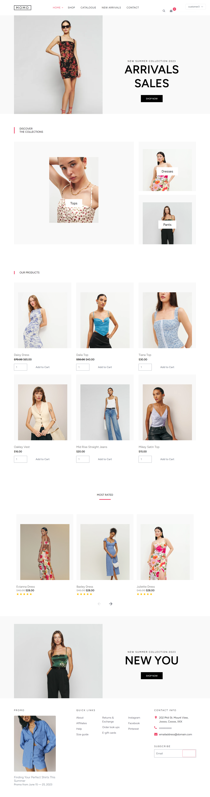

<h1>Online Clothing Retail Store with CRM Integration</h1>



## Table of Contents
- [Introduction](#introduction)
- [Project Document](#document)
- [Features](#features)
- [Getting Started](#getting-started)
    - [Prerequisites](#prerequisites)
    - [Installation](#installation)
- [Technologies Used](#usage)
- [License](#license)

## Introduction <a name="introduction"></a>

This project presents an innovative e-commerce solution merged with an advanced Customer Relationship Management (CRM) system, tailored specifically for an online clothing retail store. Its core purpose is to optimize the online shopping journey for customers, while simultaneously providing businesses with a robust tool to efficiently manage customer relationships and sales operations.

This initiative aims to establish a highly intuitive and user-friendly platform that offers a diverse array of clothing products, ensuring a secure and seamless transaction process. Through the implementation of an integrated CRM system, businesses can readily track customer preferences, manage orders, and provide personalized customer interactions, fostering customer satisfaction and loyalty.

By seamlessly integrating e-commerce functionalities with a sophisticated CRM infrastructure, this project strives to elevate the online shopping experience, enabling businesses to cultivate lasting customer relationships and enhance their overall operational efficacy within the competitive realm of online clothing retail.

## Project Document <a name="document"><a/>

You can access the project document [here](Documents/SSP2-FinalReport-CB010303.pdf).

## Features <a name="features"></a>

- Intuitive online platform for effortless browsing and purchasing of clothing items.
- Robust user authentication and secure login mechanisms to ensure the safety and privacy of user accounts and information.
- Comprehensive product details and up-to-date availability status for all clothing items.
- Secure and dependable payment methods, utilizing Stripe for a seamless transaction process.
- Discount support for promotional activities and special offers on clothing items.
- Efficient cart management for a smooth shopping experience, including adding, removing, and saving items for future purchases.
- Integrated CRM functionality to facilitate effective management of customer relationships.
- Streamlined order processing with real-time monitoring of order status.
- Data analytics and comprehensive reporting tools to support informed and data-driven business decisions.

## Getting Started <a name="getting-started"></a>

### Prerequisites <a name="prerequisites"></a>

- PHP 8 or higher
- Node.Js
- Composer 

### Installation <a name="installation"></a>

1. Clone the repository:

```bash
npm start
```

2. Install dependencies:
   
```bash
composer install && npm install && npm run dev
```
   
3. Configure your environment variables:

```bash
ncp .env.example .env
```

4. Run migrations:

```bash
php artisan migrate
```

5. Serve the application:

```bash
php artisan serve
```

6. Run the build:

```bash
npm run dev
```


## Technologies Used <a name="usage"></a>

- Frameworks: Laravel, Alpine.js (JavaScript Framework), Bootstrap (CSS 
Framework), Tailwind CSS (CSS Framework) 
- Application Scaffolding: Laravel Jetstream 
- Libraries: Livewire, Chart.js
- Languages: PHP, JavaScript
- Database: MySQL
- Payment Processing: Stripe

## License <a name="license"></a>

The Laravel framework is open-sourced software licensed under the [MIT license](https://opensource.org/licenses/MIT).


<table style="border-collapse: collapse;">
<table style="border: none; border-collapse: collapse;">
  <tr>
    <td style="border: none;">
      <p align="center">
        <a href="https://laravel.com" target="_blank">
          
        </a>
      </p>
    </td>
    <td style="border: none;">
      
    </td>
  </tr>
</table>


